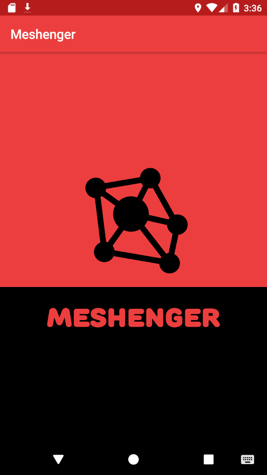
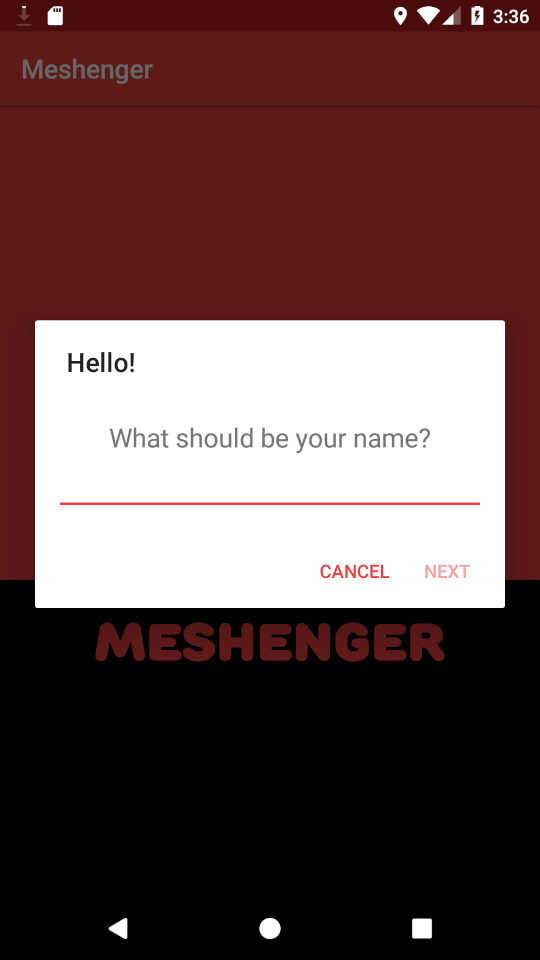
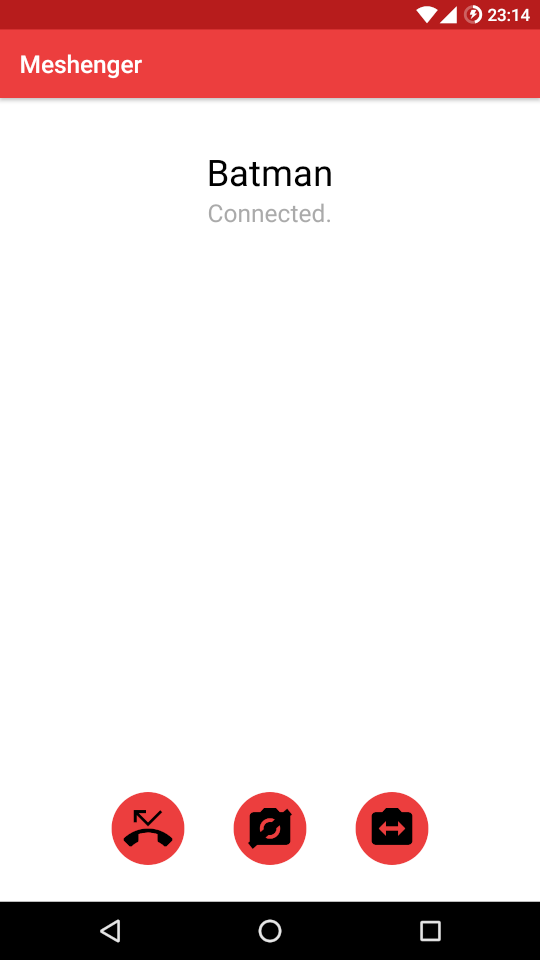
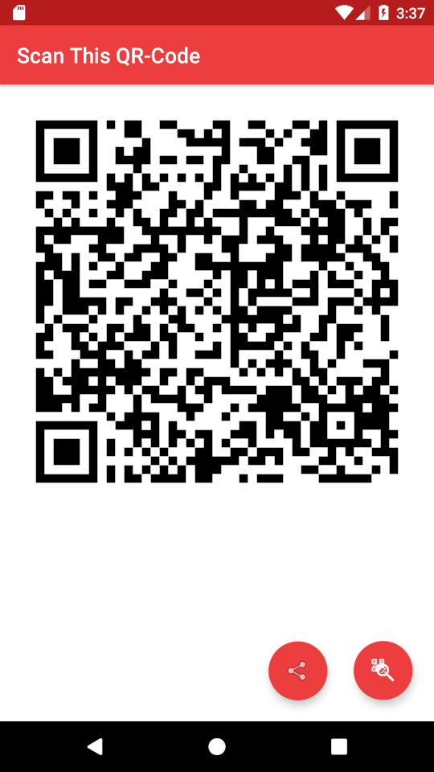
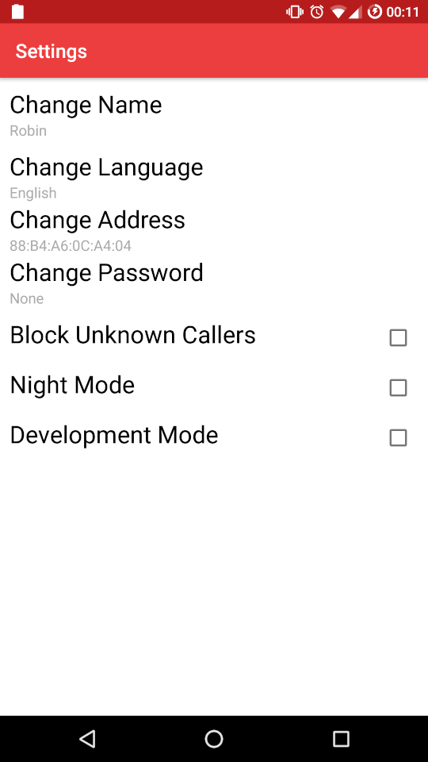

# Meshenger

 Voice- and video calls without any server or Internet access. Simply scan each others QR-Code and call each other. This works in many local networks such as community mesh networks, company networks or at home.

Features:

- audio and video calls
- encrypted communication
- database backup and encryption
- add custom addresses to reach contacts

## Download

## Screenshots

    

## Documentation

Meshenger exchanges the contact name, public key and MAC address via QR-Code. The MAC address is used to create an IP address to connect to clients. This does not even need a DHCP server. The exchanged public key is used to authenticate/encrypt signaling data to establish a [WebRTC](https://webrtc.org/) session that can trasmit audio and video.

Details can be found in the [Documentation](docs/Documentation.md) or in the [FAQ](docs/faq.md).
