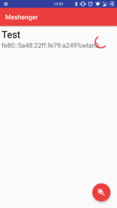
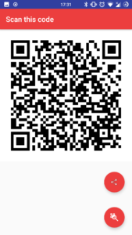
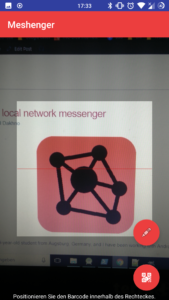
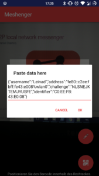

# Meshenger - An Open-Source P2P Messenger

This Android app allows voice- and videocommunication without any server or Internet access. Simply scan each others contact QR-Code and call each other. This works on most networks such as community networks or even company networks.

## How Does It Work?

### Finding Contacts

Contacts are found by taking the devices own IPv6 addresses and replacing the devices own MAC address by the contacts MAC address. This results in using IPv6 Link Local addresses (fe80::/10) and Unique Unicast addresses (fc00::/7 using the [EUI-64](https://de.wikipedia.org/wiki/EUI-64) format).

### Audio/Video transmission

Audio and Video are transmitted via [WebRTC](https://webrtc.org/). WebRTC is a standard that is also implemented in all major web browsers. WebRTC has facilities to circumvent NAT scenarios via servers (Meshenger does not use this feature), Audio and Video codecs and end to end encryption.

WebRTC does not support signaling and authentication. The signaling information is transmitted directly as plaintext.

## Project Context

This project was sponsored by the [Google Summer of Code](https://summerofcode.withgoogle.com/) 2018 as part of the [Freifunk](https://freifunk.net) organization to make local community networks more attractive.

The development can be followed via the [Freifunk blog](https://blog.freifunk.net):

* [Initial Project Description](https://projects.freifunk.net/#/projects?project=local_phone_app&lang=en)
* [Meshenger Update 1](https://blog.freifunk.net/2018/06/10/meshenger-p2p-local-network-messenger-update-1/)
* [Meshenger Update 2](https://blog.freifunk.net/2018/07/07/meshenger-p2p-local-network-messenger-update-2/)
* [Meshenger final update](https://blog.freifunk.net/2018/08/14/meshenger-p2p-local-network-messenger-final-update/)

## Ideas/Future Plans

* optional global connection via Internet in case no local connection is available
* optional direct connection via WiFi-Direct in case no AccessPoint is available
