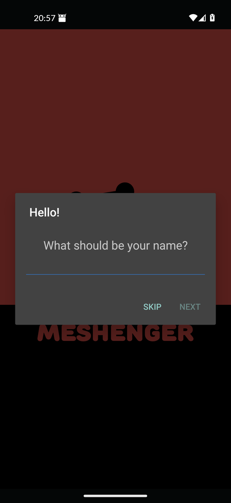
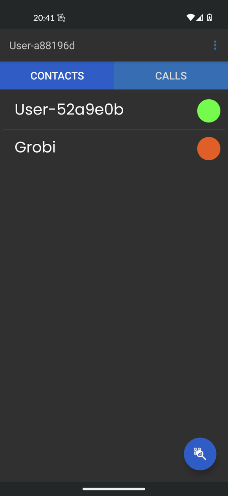
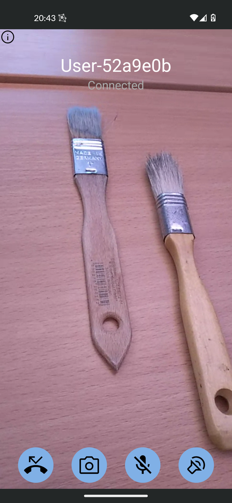
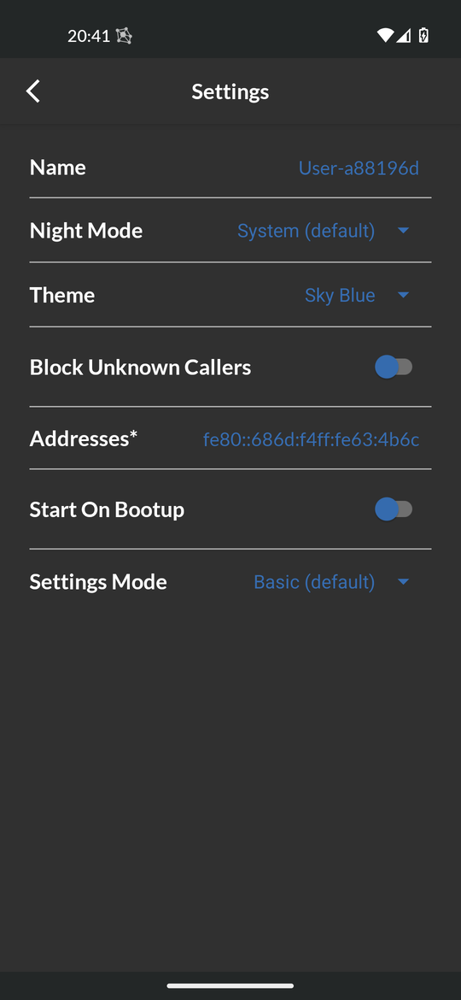
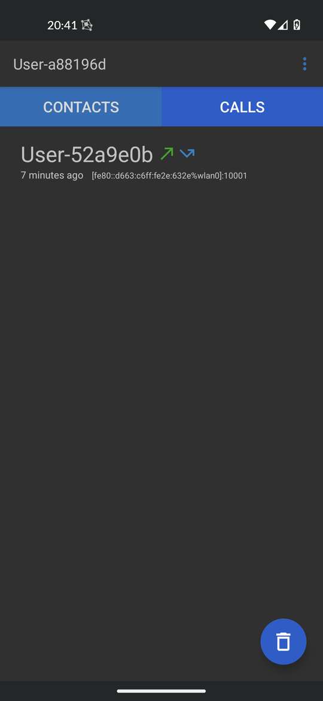

# Meshenger

Direct voice- and video phone calls. No need for accounts or access to the Internet. Just scan each others QR-Code that will contain the contacts IP address. This works at home or company networks but also in many off-the-grid networks such as community mesh networks.

Features:

- voice and video calls
- encrypted communication
- no accounts, no registration, no servers
- add custom addresses to reach contacts

Limitations:

- no calls through firewalls / NAT borders
- IP address change requires manual contact update

## Download

[](https://apps.obtainium.imranr.dev/redirect?r=obtainium://app/%7B%22id%22%3A%22d.d.meshenger%22%2C%22url%22%3A%22https%3A%2F%2Fgithub.com%2Fmeshenger-app%2Fmeshenger-android%22%2C%22author%22%3A%22meshenger-app%22%2C%22name%22%3A%22Meshenger%22%2C%22preferredApkIndex%22%3A0%2C%22additionalSettings%22%3A%22%7B%5C%22includePrereleases%5C%22%3Afalse%2C%5C%22fallbackToOlderReleases%5C%22%3Atrue%2C%5C%22filterReleaseTitlesByRegEx%5C%22%3A%5C%22%5C%22%2C%5C%22filterReleaseNotesByRegEx%5C%22%3A%5C%22%5C%22%2C%5C%22verifyLatestTag%5C%22%3Afalse%2C%5C%22sortMethodChoice%5C%22%3A%5C%22date%5C%22%2C%5C%22useLatestAssetDateAsReleaseDate%5C%22%3Afalse%2C%5C%22releaseTitleAsVersion%5C%22%3Afalse%2C%5C%22trackOnly%5C%22%3Afalse%2C%5C%22versionExtractionRegEx%5C%22%3A%5C%22%5C%22%2C%5C%22matchGroupToUse%5C%22%3A%5C%22%5C%22%2C%5C%22versionDetection%5C%22%3Atrue%2C%5C%22releaseDateAsVersion%5C%22%3Afalse%2C%5C%22useVersionCodeAsOSVersion%5C%22%3Afalse%2C%5C%22apkFilterRegEx%5C%22%3A%5C%22%5C%22%2C%5C%22invertAPKFilter%5C%22%3Afalse%2C%5C%22autoApkFilterByArch%5C%22%3Atrue%2C%5C%22appName%5C%22%3A%5C%22%5C%22%2C%5C%22appAuthor%5C%22%3A%5C%22%5C%22%2C%5C%22shizukuPretendToBeGooglePlay%5C%22%3Afalse%2C%5C%22allowInsecure%5C%22%3Afalse%2C%5C%22exemptFromBackgroundUpdates%5C%22%3Afalse%2C%5C%22skipUpdateNotifications%5C%22%3Afalse%2C%5C%22about%5C%22%3A%5C%22%5C%22%2C%5C%22refreshBeforeDownload%5C%22%3Afalse%7D%22%2C%22overrideSource%22%3Anull%7D)

## Screenshots

       

## Translations

Visit [weblate.org](https://hosted.weblate.org/engage/meshenger/) to contribute translations. An alternative is to directly translate the values in [strings.xml](https://github.com/meshenger-app/meshenger-android/blob/master/app/src/main/res/values/strings.xml) and then to create a pull request or send it via Email.

## Documentation

Meshenger connects to IP addresses in a true P2P fashion. Contacts are encoded in a text blob that can be exchanged via QR-Code, picture or copy&paste. They contain a name, a public key and a list of IP addresses or domain names. Also IPv6 link local addresses are supported, which would not even need a DHCP server. The exchanged public key is used to authenticate/encrypt signaling data to establish a [WebRTC](https://webrtc.org/) session that can transmit voice and video.

Details can be found in the [Documentation](docs/documentation.md) or in the [FAQ](docs/faq.md).

## License

GNU GENERAL PUBLIC LICENSE 3.0 or later, see [license text](LICENSE) or on [spdx.org](https://spdx.org/licenses/GPL-3.0-or-later.html).

## Similar Projects

This list only contains Open Source projects.

* [linphone](https://linphone.org/) - VoIP, SIP, Video telephone app.
* [Jami](https://jami.net/) - Multiplatform Chat and Video messenger, uses a DHT.
* [Briar](https://briarproject.org/) - Censorship-resistant P2P messaging. Connect via Bluetooth, Wi-Fi or Tor. Privacy orientated.
* [Qaul](https://qaul.net/) - Internet independent wireless mesh text messenger. Uses BLE, Wifi & Internet-overlay.
* [pion offline](https://github.com/pion/offline-browser-communication) - Offline WebRTC demo.
