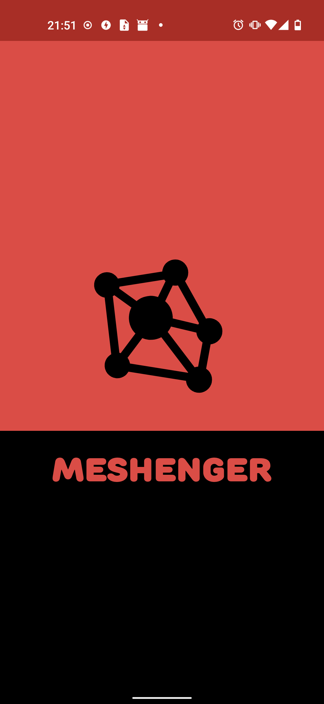
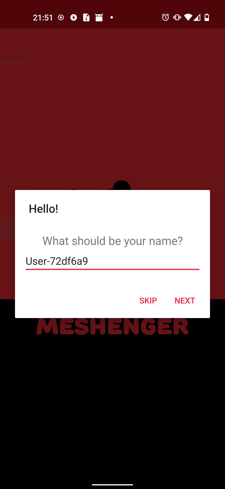
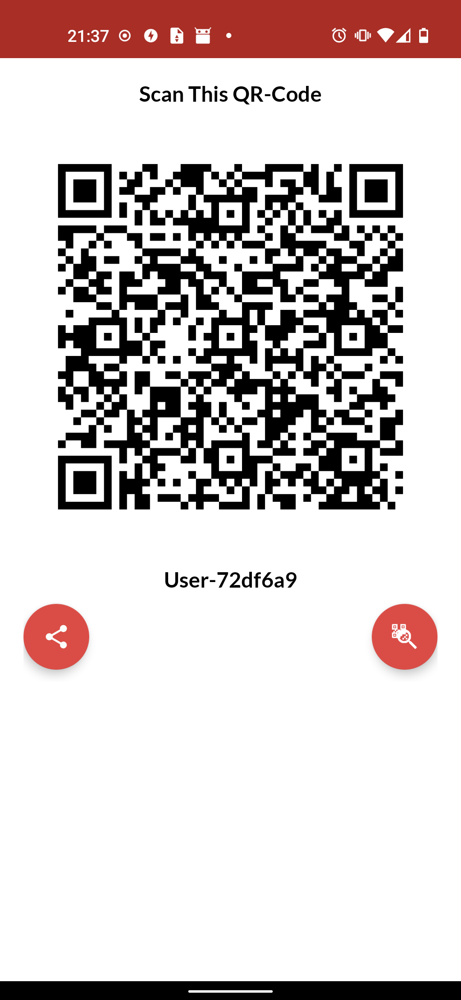
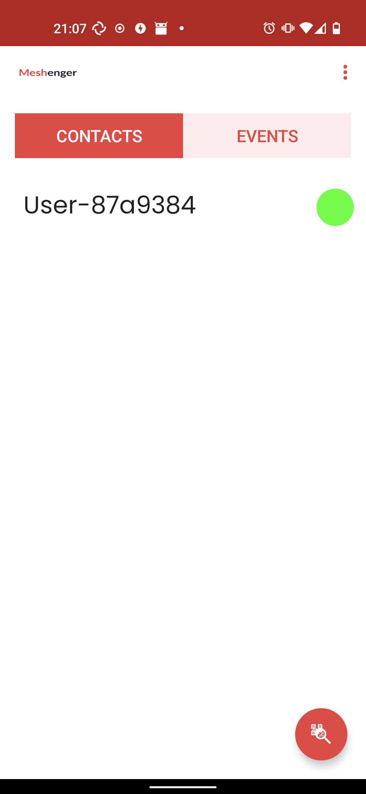
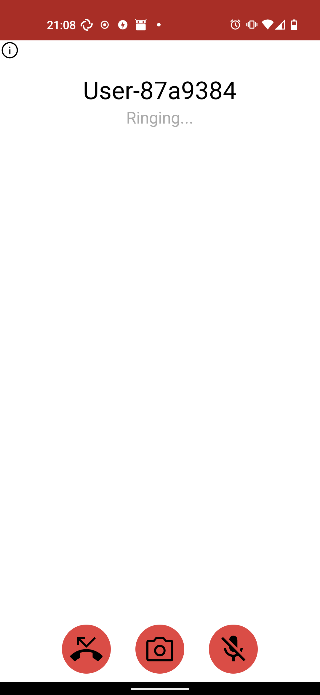
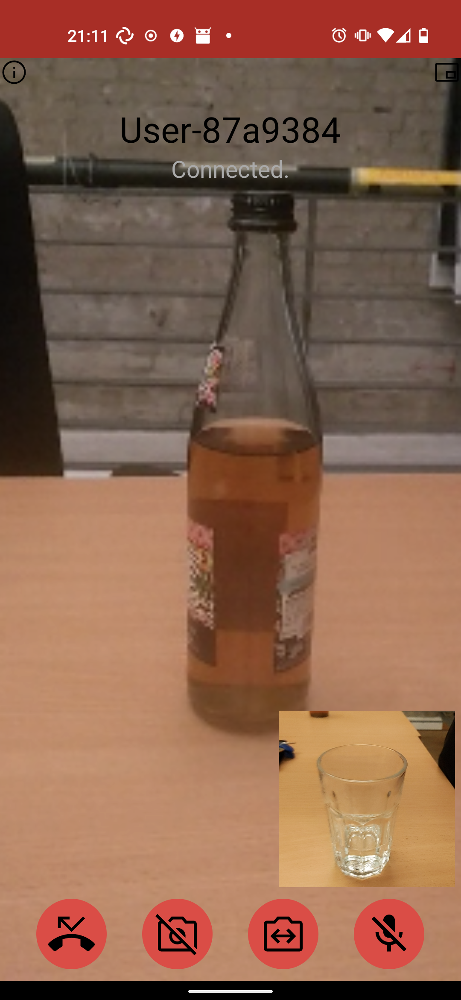
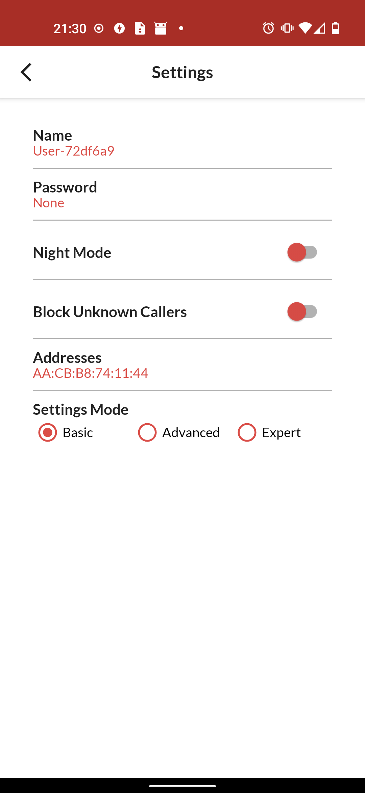
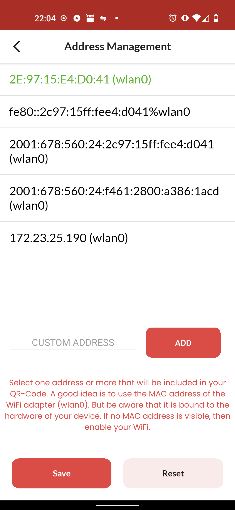

# Meshenger

True P2P voice- and video phone calls without the need for accounts or access to the Internet. There is no discovery mechanism, no meshing and no servers. Just scan each others QR-Code that will contain the contacts IP address. This works in many local networks such as community mesh networks, company networks or at home.

Features:

- voice and video calls
- no accounts or registration
- encrypted communication
- database backup and encryption
- add custom addresses to reach contacts

Limitations:

- no calls through firewalls / NAT borders
- no calls after MAC / IP address change

## Download

## Screenshots

       

## Documentation

Meshenger connects to IP addresses in a true P2P fashion. Contacts are shared via QR-Code. They contain a name, a public key and a list of MAC/IPv4/IPv6 addresses or domain names. By default, only a single MAC address is transferred and used to create an IPv6 link local address (among others) to establish a connection. This does not even need a DHCP server. The exchanged public key is used to authenticate/encrypt signaling data to establish a [WebRTC](https://webrtc.org/) session that can transmit voice and video.

Details can be found in the [Documentation](docs/documentation.md) or in the [FAQ](docs/faq.md).

## Similar Projects

* [linphone](https://linphone.org/) - many features, uses SIP, can use IP addresses, but not easy to use
* [Keet](https://keet.io) - many features, uses a DHT, Bitcoin payments
* [Briar](https://briarproject.org/) - text messages only, for the Internet the Tor network is used
* [Jami](https://jami.net/) - many features, but might not work in mesh or local networks
* [Berty](https://berty.tech/) - text messages only, uses Bluetooth LE
* [Qaul](https://qaul.net/) - many features, interlinked P2P mesh via BLE, Wifi & Internet-overlay
