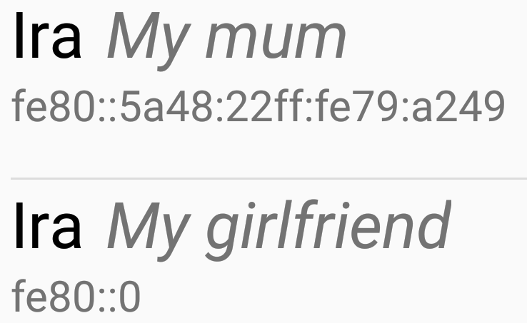

Meshenger documentation
=======================

## Motivation

Currently, the market of VoIP software is dominated by software owned by big companies and tied to central infrastructures in order to monetize the platform and control the data flow.
Individuals and community networks like Freifunk often try to establish decentralized networks, which provide a community infrastructure to provide Internet to areas not yet covered and to connect people with local pathways.
Yet, the hotspots provided by e.g. Freifunk are often simply perceived as sole Internet access points.
Thus we want to provide a proof-of-concept demonstrating for the use of any network without having an Internet connection or even a DCHP server present.
Of course, the use of such an app would not be restricted to Freifunk networks, it should also be applicable in disaster areas, where Internet access is cut off, home or company networks and conventions.

As practical as this approach may seem, as of now there are no VoIP applications that are not depended on Internet access.
Thus, our goal was to create an Open Source, decentralized messenger supporting audio- as well as video calling through,
that makes it as easy as to add a contact as scanning a qr-code on another phone.

We decided to start coding for Android, since mobile devices are the most ubiquitous devices and Android is simply the most wide-spread platform in this segment with over 80% market share.

## Concept

One of our goals was to be able to operate in networks without a IPv4 or IPv6 DHCP server, but with a focus on making use of IPv6. Since many community networks block Broadcast/Multicast, we also wanted to avoid using Broadcasts.
[WebRTC](https://en.wikipedia.org/wiki/WebRTC) is used for Audio/Video transmission as it is supported on many platforms such as web browsers and promises a maximum of interoperability.

To keep contact sharing as simple as possible, qr-codes are used to share contact information between devices.
For a simple usage example we imagine two users users Daniel and Anika.
Anika clicks a button in her app, which makes a qr-code appear on her screen:


Daniel in return clicks a second button on his phone, which respectively opens a scanner:

.

After the scanner has successfully scanned the code, the phones automatically exchange information like the username, 
the mac-address, the IPv6 link-local-address if possible, the IPv4 address as a fallback, making Daniel appear in Annikas contact list and vice versa.

Finally, when one clicks the name of the other contact, the app tries to reach that contact through the saved address.
In case of failure the app tries to mutate that address considering its own network prefix and the mac-address of the target.
Is this connection established, a handshake is transmitted and finally a call is established using the WebRTC-PeerConnection etc. classes.

## Features

Obviously, the app allows for video and audio communication, whereas the latter can be enabled/disabled during a call.
To add a contact you simply scan his QR-code, but contacts can be shared through third-party communication channels asweell,
by sending a JSON string containing his information over email, whatsapp or similar.
Since several contacts may have similar names, each contact can have short additional information set in his name.



Since we may have users from different regions, we internationalized as much as possible, although yet only German and English is supported.
Adding a new language is as simple as adding a xml with all the translations.
The language can be switched locally in the app, independant from the device language setting.

## IPv6

For the initial connection, we need a way to find the IP address of the other device.
During the qt-code scan, the mac address of the wifi interface and an IPv6 or IPv4 address are transmitted.

A device finds a contact by looking at the devices own IPv6 addresses and check if the own mac address is contained there. If this is the case, the mac address of the contact is inserted and the resulting address is used to send a ping message to the potential contact. If a replied is received the contact has been found.

Assuming the mac address of a device is 01:23:45:56:78:90, then the link local address (fe80::/64) might look like this:
```
fe80::0123:4556:7890
```

The link local address is always present on an interface even if not network is connected.

If a IPv6 prefix is transmitted from the router, e.g. fdef:1701:b5ee:4200/64:
```
fdef:1701:b5ee:4200:0123:45ff:fe56:7890
```
(notice the inserted ff:fe as part of the [EUI64](https://de.wikipedia.org/wiki/EUI-64) scheme)

A possible problem with this approach could be the presence of activated IPv6 privacy extensions that are often activated on Android. This causes the IPv6 not to contain the mac-address, but random values after the prefix.

In practice however, we have discovered, that every Android device we have checked have at least the link local IPv6 address that is based on its own mac address.
Local IPv6 addresses (fc00::/7) also contain the mac address. But IPv6 privacy extensions seem to generate a second local address that are based on random values. This address is used for external connections.

This means that we can expect this approach to work on many devices.

## WebRTC

We decided to use WebRTC since it is a well-build, tested and mostly documented standard for video- and audio communication, which is exactly what we needed. 
It handles reading the camera and microphone input, encodes that data and tries to find the way with the lowest possible latency to send the data.
Since, in most environments, due to NATs a direct connection is not possible, WebRTC handles NAT traversal, or even completely redirects the traffic over a TURN server.
We turned off both of these servers, since our application is designed to work P2P in local networks.

Normally, to find the best possible route between two nodes a STUN server is used, since that normally needs an external server.
Since WebRTC is used in many different mobile and web applications we have room for scalability, giving us the possibility to adapt to other projects and applications. The signalling, e.g. the exchange of relevant networking information has to be done by the application.
In the case of Meshenger, an 'offer' is created by the WebRTC API of the initiating application.
This offer is then encoded in a JSON object and transmitted to the receiver using IPv6 as explained above, which then creates an 'answer'.
That answer is then transmitted back to the initiator, where it is then fed back to the WebRTC API.
Upon this point, WebRTC takes over, creates a connection and starts transmitting audio and video.
